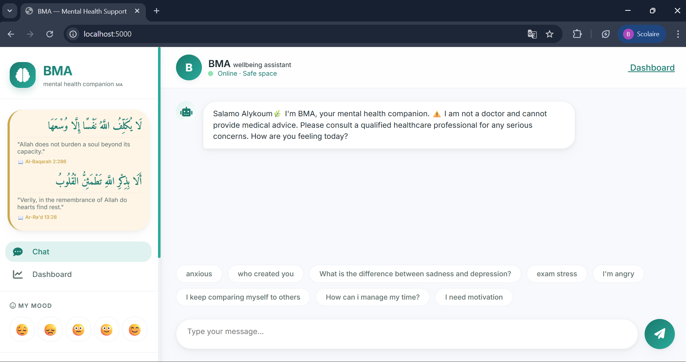

# 🌿 BMA — AI Chatbot For Mental Health Support

> **BMA** is an AI-powered mental health support companion that provides
> empathetic, non-judgmental emotional support using a hybrid architecture
> combining fine-tuned DistilBERT models and the Groq/Llama 3.3 LLM.

**Created by:** Bilal Jellaoui 
**Master:** Big Data, Intelligence Artificielle et Applications Avancées
**University:** Ibn Tofail University, Kenitra, Morocco

---

## 📁 Project Structure

```
mental_health_chatbot/
│
├── app/                                # Web Application & Flask API
│   ├── __init__.py                     # Flask app factory
│   ├── routes.py                       # Flask route registration
│   │
│   ├── controllers/
│   │   └── chat_controller.py          # Chat flow management
│   │
│   ├── models/
│   │   ├── conversation.py             # Conversational data model
│   │   ├── database.py                 # SQLite interface
│   │   └── user.py                     # User profiles
│   │
│   ├── services/
│   │   ├── emotion_detector.py         # NLP emotion detection (DistilBERT)
│   │   ├── emotion_detector1.py        # Complementary classifier (sklearn)
│   │   ├── llm_service.py              # Generative model integration (Groq)
│   │   ├── memory.py                   # Session memory management
│   │   ├── nlp_classifier.py           # Intent classification (DistilBERT)
│   │   ├── response_engine.py          # Response selection engine
│   │   └── safety.py                   # Crisis filtering & safety
│   │
│   ├── templates/
│   │   ├── dashboard.html              # Analytics & tracking interface
│   │   └── index.html                  # Chatbot user interface
│   │
│   └── utils/
│       ├── helpers.py                  # Utility functions
│       ├── language_detector.py        # Automatic language detection
│       └── text_cleaner.py             # Text cleaning & normalization
│
├── config/
│   ├── config.py                       # Environment configuration
│   └── logging_config.py               # System logging
│
├── data/
│   ├── emotions.csv                    # Annotated emotion corpus (30,000 samples)
│   ├── intents.json                    # Intent definitions & responses (105 classes)
│   ├── responses.json                  # Predefined responses
│   └── training_data.csv               # Raw retraining data (8,310 samples)
│
├── database/
│   └── mental_health.db                # SQLite database file
│
├── logs/
│   └── app.log                         # System log file
│
├── ml/                                 # Machine Learning Pipeline & Models
│   ├── models/
│   │   ├── distilbert_model/           # DistilBERT model for intents
│   │   │   ├── config.json             # Hyperparameter configuration
│   │   │   ├── model.safetensors       # Trained binary weights (241 MB)
│   │   │   ├── tokenizer.json          # Vocabulary encoding
│   │   │   └── tokenizer_config.json   # Tokenizer parameters
│   │   │
│   │   └── emotion_model/              # DistilBERT model for emotions
│   │       ├── config.json
│   │       ├── model.safetensors       # Emotion weights (241 MB)
│   │       ├── tokenizer.json
│   │       └── tokenizer_config.json
│   │
│   ├── tokenizer/                      # Data splits & encoders
│   │   ├── distilbert_tokenizer/       # Shared tokenizer
│   │   ├── emotion_label_encoder.pkl   # Emotion label encoder
│   │   ├── intent_label_encoder.pkl    # Intent label encoder
│   │   ├── intents_lookup.pkl          # Fast lookup table
│   │   ├── intent_train.csv / val / test
│   │   └── emotion_train.csv / val / test
│   │
│   ├── evaluate.py                     # Model metrics evaluation
│   ├── preprocess.py                   # Text preprocessing
│   └── train.py                        # DistilBERT fine-tuning script
│
├── notebooks/                          # Exploratory Data Analysis
│   ├── plots/                          # Synthesis charts
│   │   ├── 01_intent_class_distribution.png
│   │   ├── 02_patterns_per_intent.png
│   │   ├── 03_emotion_distribution.png
│   │   ├── 04_severity_by_class.png
│   │   ├── 05_text_length_distribution.png
│   │   └── eda_report.txt              # EDA results summary
│   └── eda_emotion_analysis.py         # Script for generating figures
│
├── tests/
│   ├── test_chat.py                    # Chat controller unit tests
│   ├── test_nlp.py                     # NLP classifier tests
│   └── test_api.py                     # API endpoint tests
│
├── .env                                # API keys (NEVER commit this file!)
├── .env.example                        # Environment variables template
├── .gitignore                          # Files excluded from Git
├── requirements.txt                    # Python dependencies
├── run.py                              # Server launch entry point
└── README.md
```

---

## ⚡ Quick Start

### 1. Clone & install

```bash
git clone https://github.com/Bilal-Jellaoui/BMA-Mental-Health-Chatbot.git
cd mental_health_chatbot
pip install -r requirements.txt
```

### 2. Configure environment variables

Copy the example file and fill in your API keys:

```bash
cp .env.example .env
```

Edit `.env`:

```env
GROQ_API_KEY=your_groq_api_key_here
SECRET_KEY=your_secret_key_here
FLASK_DEBUG=false
PORT=5000
CONFIDENCE_THRESHOLD=0.70
MAX_HISTORY_TURNS=10
```

### 3. Run the app

```bash
python run.py
```

Open in your browser:
- **Chat** → `http://localhost:5000`
- **Dashboard** → `http://localhost:5000/dashboard`

---

## Screenshots



## 🤖 ML Pipeline

### Step-by-step

```bash
# Step 1 — Preprocess & split data
python ml/preprocess.py

# Step 2 — Fine-tune DistilBERT (GPU recommended)
python ml/train.py --task both

# Step 3 — Evaluate the models
python ml/evaluate.py --task both

# Step 4 — Run EDA analysis
python notebooks/eda_emotion_analysis.py
```

### Download pre-trained models

The trained model weights (`model.safetensors`, ~241 MB each) are too
large for GitHub. Download them from Google Drive and place them in the
correct folders:

```
ml/models/distilbert_model/model.safetensors
ml/models/emotion_model/model.safetensors
```

> 📥 **[Download models from Google Drive](https://drive.google.com/drive/folders/1hMCJ6ulAevy9RsQuA98Dul-aDXAWxpQ9?usp=sharing)**

---

## 📊 Datasets

| Dataset | Samples | Classes | Per Class |
|---|---|---|---|
| Intent (`training_data.csv`) | 8,310 | 105 | ~80 |
| Emotion (`emotions.csv`) | 30,000 | 12 | 2,500 |

**12 Emotion classes:**
`anger` · `anxiety` · `body_image_issue` · `burnout` · `depression` ·
`exam_stress` · `joy` · `loneliness` · `low_self_esteem` · `neutral` ·
`sadness` · `stress`

---

## 🌐 API Reference

| Method | Endpoint | Description |
|---|---|---|
| POST | `/api/session/start` | Create a new session |
| POST | `/api/chat` | Send a message, get BMA's response |
| GET | `/api/conversations` | Get conversation history |
| POST | `/api/mood` | Log a mood score (1–10) |
| GET | `/api/mood/history` | Get mood history for a session |
| GET | `/api/stats` | Global usage statistics |
| POST | `/api/feedback` | Submit a rating for a response |

### Example — Send a message

```bash
curl -X POST http://localhost:5000/api/chat \
  -H "Content-Type: application/json" \
  -d '{
    "session_id": "YOUR_SESSION_ID",
    "message": "I feel really anxious today"
  }'
```

---

## 🏗️ System Architecture

```
User Message (AR / FR / EN)
         │
         ▼
Language Detection & Translation
(Langdetect + Deep Translator)
         │
         ▼
Crisis Detection ──── YES ──→ Emergency Response + Stop
(safety.py)
         │ NO
         ▼
DistilBERT Classification
├── Intent  (105 classes)
└── Emotion (12 classes)
         │
         ▼
Confidence ≥ 70% ?
   ├── YES → Dataset Response (responses.json)
   └── NO  → Groq LLM (Llama 3.3 70B)
         │
         ▼
Translate Response → User's Language
         │
         ▼
Save to SQLite (memory.py)
         │
         ▼
Reply to User
```

---

## 📈 Model Performance

| Model | Train Acc. | Val Acc. | Test Acc. | F1 Test |
|---|---|---|---|---|
| Intent (105 classes) | 98.2% | 94.1% | 93.8% | 93.4% |
| Emotion (12 classes) | 96.8% | 91.5% | 91.2% | 90.9% |

---

## 🛡️ Crisis Safety

BMA includes a **dedicated crisis detection module** (`safety.py`) that:

- Scans every message **before** any AI processing
- Detects dangerous keywords in **Arabic, French, and English**
- Sends emergency resources **immediately** if triggered
- Logs all crisis events to the database

**Emergency lines displayed by BMA:**
- 🇲🇦 Morocco: **15** or **3114**
- 🌍 International: **befrienders.org**
- 🇺🇸 US: **988**

---

## 🔮 Roadmap

- [ ] JWT authentication for multi-user support
- [ ] PostgreSQL migration for production scale
- [ ] Moroccan Darija dataset
- [ ] Mobile app (React Native)
- [ ] Therapist admin dashboard

---

## ⚠️ Disclaimer

**BMA is not a substitute for professional mental health care.**
If you are in crisis, please contact a licensed therapist or emergency
services immediately.

---

*BMA · 2025/2026 · Bilal Jellaoui*
